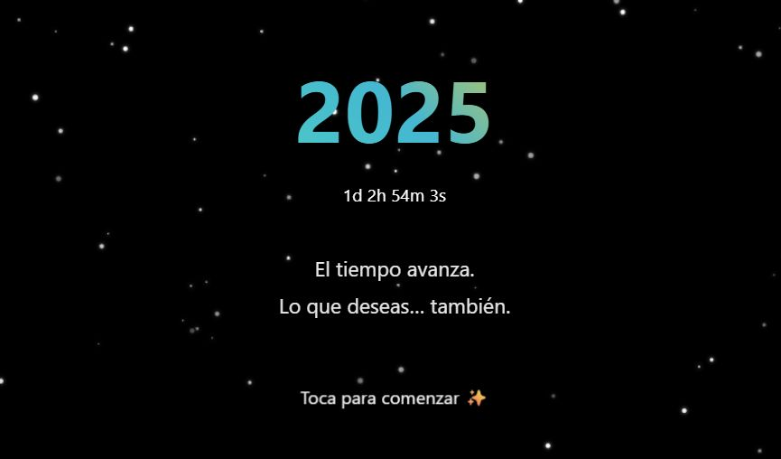

# ✨ Propósitos de Año Nuevo 2026

Una experiencia interactiva para planificar tus propósitos de Año Nuevo de forma memorable.  
Combina animaciones, selección de propósitos, imágenes y generación de un PDF personal para guardar tus metas.




## 🔵 Características

- **Animación de Estrellas Interactiva**: Estrellas parpadeantes durante toda la experiencia
- **Contador Regresivo**: Cuenta atrás en tiempo real hasta 2026
- **Experiencia Personalizada**: Ingresa tu nombre para un recorrido personalizado
- **Sugerencias Predefinidas**: Selección rápida de propósitos comunes
- **Objetivos Personalizados**: Crea tus propios propósitos con texto e imágenes
- **Soporte de Imágenes**: Añade motivación visual mediante carga de archivos o URL
- **Exportación Profesional a PDF**: Descarga tus propósitos para verlo cuando quieras en PDF
- **Celebración con Fuegos Artificiales**: Animación colorida de fuegos artificiales tras descargar el PDF


## 🔵 Requisitos Previos

- Navegador web (Chrome, Firefox, Safari, Edge)
- Conexión a internet (para cargar la librería html2pdf.js desde CDN)

## 🔵 Instalación

1. Clona el repositorio:
```
git clone https://github.com/Aday25/new-year-goals-2026.git
```

2. Navega al directorio del proyecto:
```
cd new-year-resolutions-2026
```

3. Abre `index.html` en tu navegador favorito o usa un servidor local:

---
## 🔵 Estructura del Proyecto
```
new-year-goals-2026/
│
├── index.html              # Estructura HTML principal
├── styles/
│   └── main.css           # Estilos de la aplicación
├── scripts/
│   ├── background.js      # Animación de estrellas y fuegos artificiales
│   ├── app.js             # Lógica principal de la aplicación
│   └── pdf.js             # Generación del PDF
├── assets/
│   └── preview.jpg        # Imagen de vista previa
└── README.md              # Documentación del proyecto
```

## 🔵 Uso

1. **Pantalla de Inicio**: Haz clic en "Toca para comenzar ✨"
2. **Ingresa tu Nombre**: Escribe tu nombre para personalizar la experiencia
3. **Selecciona Sugerencias**: Elige propósitos predefinidos o continúa para crear los tuyos
4. **Crea tus Propósitos**: 
   - Escribe tus objetivos personalizados
   - Añade imágenes motivacionales (archivo local o URL)
   - Usa el botón "Añadir otro propósito" para más objetivos
5. **Descarga tu Plan**: Haz clic en "Descargar plan en PDF"
6. **Celebra**: Disfruta de los fuegos artificiales mientras se genera tu PDF

## 🔵 Tecnologías Utilizadas

- **HTML5**: Estructura semántica
- **CSS3**: Animaciones, gradientes y efectos visuales
- **JavaScript (Vanilla)**: Lógica de la aplicación
- **Canvas API**: Animaciones de fondo (estrellas y fuegos artificiales)
- **html2pdf.js**: Generación de PDF desde HTML

## 🔵 Características de Animación

### Estrellas
- 200 estrellas con brillo y parpadeo aleatorio
- Efecto glow (resplandor) con `shadowBlur`
- Opacidad variable entre 0.2 y 1.0

### Fuegos Artificiales
- Cohetes con trayectoria realista
- 80-120 partículas por explosión
- Colores aleatorios en espectro HSL
- Física aplicada: gravedad y fricción
- Efectos de desvanecimiento progresivo


## 🤝 Contribuciones

Las contribuciones son bienvenidas. Por favor:

1. Haz fork del proyecto
2. Crea una rama para tu característica (`git checkout -b feature/AmazingFeature`)
3. Commit de tus cambios (`git commit -m 'feat: add some AmazingFeature'`)
4. Push a la rama (`git push origin feature/AmazingFeature`)
5. Abre un Pull Request


---

⭐ Si te gusta este proyecto, ¡dale una estrella en GitHub! ⭐

✨ Por un 2026 lleno de propósitos cumplidos 👏🏻
